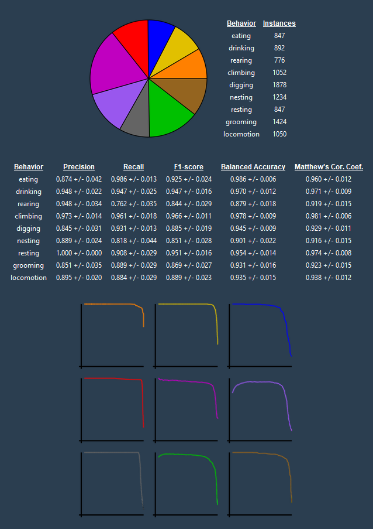
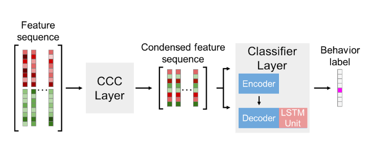

    

# CBAS (Circadian Behavioral Analysis Suite)

### WARNING: this is a pre-release version of CBAS, if you identify an error or bug, please create an issue thread!

CBAS is a suite of tools for phenotyping complex animal behaviors. It is designed to automate classification of behaviors from active live streams of video data and provide a simple interface for visualizing and analyzing the results. CBAS currently supports automated inferencing from state-of-the-art machine learning vision models including DeepEthogram (DEG) and Deeplabcut (DLC). CBAS also includes an attentive LSTM (A-LSTM) sequence model, which is designed to be more robust and more accurate than the original DEG sequence model. 

Written and maintained solely by Logan Perry, a post-bac in the Jones Lab at Texas A&M University.

* CBAS was designed with circadian behavior monitoring in mind! Here's a visual of what CBAS can do (the behaviors are not set in stone, and can be changed to fit the user's needs). 

    

* A timelapse gif of CBAS in action. CBAS is capable of inferring with both DLC and DEG models at the same time!

    

# Installation

A headless version of CBAS is coming soon and will be available via PyPI!

# Usage

The headless version of CBAS is designed to be used in ipython or jupyter notebooks. Jupyter notebooks for examples of how to use CBAS to automate pre-existing DEG or DLC models are currently under construction. Links to these example notebooks will be found below in the near future.

## Video Acquisition and Automatic Inference

CBAS was built to facilitate inferring of live video streams. The video acquisition module provides a simple interface for acquiring video from real-time network streams via RTSP. RTSP is a widely supported protocol for streaming video over the internet, and is supported by many IP cameras and network video recorders. CBAS uses ffmpeg to acquire video from RTSP streams, and can be used to acquire video from any RTSP source that ffmpeg supports. 

CBAS video acquisition can be used with or without DEG or DLC models. When used with a model or multiple models, CBAS can be used to automatically infer the behavior of animals in real time. CBAS seamlessly handles model context switching, allowing the user to inference video streams with any number or type of vision models. When a recording is finished, CBAS continues inferrencing the video stream until all videos are inferenced and gracefully exits.

* A visual of how CBAS works to inference videos in real-time. CBAS batches videos into segments and iteratively infers new video segments as they are made using DEG models, DLC models, or a combination of both. When a recording is finished, CBAS continues inferrencing the video stream until all videos are inferenced.

    

## Training Set Creation

The training set creation module allows the user to manually annotate recorded videos with behaviors of interest. The annotated videos can then be used to train a DEG model or for training a CBAS sequence model for deepethogram outputs. 

* The CBAS training set creator simplifies the process of annotating videos for training DEG or CBAS sequence models. Importantly, a user can annotate videos with the behavior of interest quickly and without having to label the entire video. The resulting annotations are saved to a file that can be used to train supervised models. 

    

## Model Validation

The model validation module allows the user to validate the performance of a DEG or CBAS sequence model on naive test sets. The user can use this module to visualize the model's performance on the videos, and to calculate the model's performance metrics (precision, recall, f1-score, balanced accuracy, etc.). 

* An example of the CBAS model validation module. A user can use this module to visualize the model's performance on the videos, to calculate the model's performance metrics, and to see the class balance of the test set.

    

## Visualization and Analysis

The visualization and analysis module provides circadian plotting tools for visualizing and analyzing the behavior of animals over time. Circadian methods of particular importance are actogram generation, behavior transition raster generation, timeseries fitting and circadian parameter extraction with CosinorPy integration, and time series exportation for ClockLab Analysis.

1. <b>Actogram generation:</b> The actogram generation module allows the user to generate actograms of the behavior of animals over time. In this example actograms are generated by binning the behavior of all animals in the population into 30 minute bins, and overlaying the transparent behaviors for each animal, in each bin.

    

2. <b>Transition Raster generation:</b> Below is an example of a population average transition raster generated by CBAS. The transition raster is generated by binning the behavior of all animals in the population into 30 minute bins, and plotting the average behavior transition probability in each bin.

    

3. <b>So much more to be announced soon:</b> Reach out to loganperry@tamu.edu for more information or to request a feature!

## CBAS Sequence Model

The CBAS sequence model is an attentive LSTM sequence model for DEG feature extractor outputs. Below is a schematic of how this model works. Briefly, the model consists of two layers. The first layer is an encoder layer for cleaning, condensing, and combining the 1024 spatial and flow features that DEG outputs. The second layer is a classification layer that takes as input a sequence of encoded outputs from the first layer and uses them to classify frame sequences into behavior classes.

    

# Credits

 - Deepethogram is a state-of-the-art vision model for inferring complex behaviors from video data. It was developed by Jim Bohnslav at Harvard. A few components of the original deepethogram package have been included in the platforms/modified_deepethogram directory. These changes were made to hold the deepethogram model in memory and to allow for real-time inferencing of video streams. Only the necessary components of the original deepethogram package were included in the modified version. Please support the original deepethogram package by visiting their repository, [here](https://github.com/jbohnslav/deepethogram).

 - Deeplabcut is a skeletal based vision model. It was developed by the A. and M.W. Mathis Labs. Please support the original deeplabcut package by visiting their repository, [here](https://github.com/DeepLabCut)

# Acknowledgements

# License

This project is licensed under the GNU Lesser General Public License v3.0. See the LICENSE file for details.