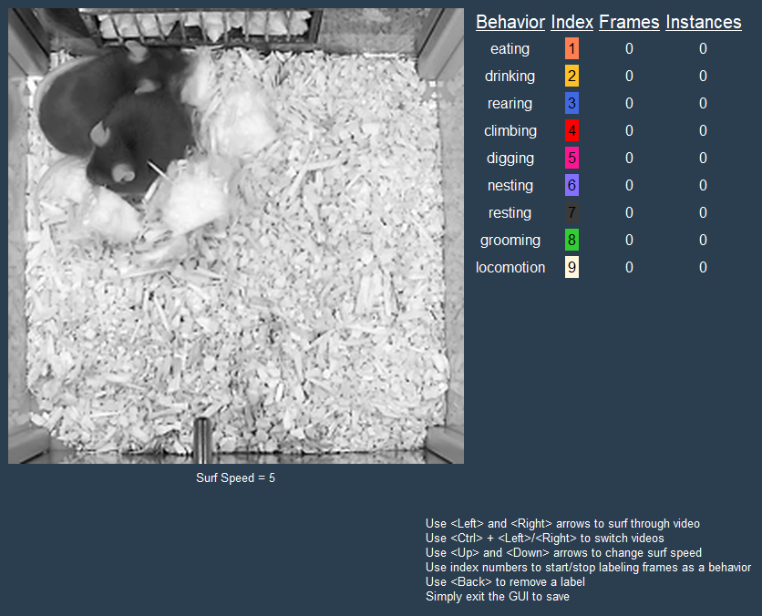

<div style="display: grid; grid-template-rows: repeat(1, 1fr); gap: 10px;">
    <div style="display: flex; flex-direction:row; align-items: center; justify-content: space-around; padding: 50px">
        
    </div>
</div>


# CBAS (Circadian Behavioral Analysis Suite)

CBAS is a suite of tools for phenotyping of complex behaviors. It is designed to automate inferencing of complex behaviors from active live streams of video data, and to provide a simple interface for visualizing and analyzing the results. CBAS currently supports automated inferencing from state-of-the-art machine learning vision models including deepethogram (DEG) and deeplabcut (DLC). CBAS also includes a transformer-based sequence model for deepethogram outputs, which is designed to be more accurate and more efficient than the original deepethogram sequence model. 

Written and maintained by Logan Perry in the Jones Lab at Texas A&M University.

* CBAS was designed with circadian monitoring in mind! Here's a visual of what CBAS can do (the behaviors are not set in stone, and can be changed to fit the user's needs). 
<div style="display: flex; flex-direction:row; align-items: center; justify-content: space-around; padding: 50px">
    
</div>

* A timelapse gif of CBAS in action. CBAS is capable of inferring with both DLC and DEG models at the same time!
<div style="display: flex; flex-direction:row; align-items: center; justify-content: space-around; padding: 50px">
    
</div>

# Installation

A headless version of CBAS is available on PyPI and can be installed using pip:

```pip install cbas_headless```

A gui version of CBAS is currently under construction and will be available soon.


# Usage

The headless version of CBAS is designed to be used in ipython or jupyter notebooks. Jupyter notebooks for examples of how to use CBAS to automate a pre-existing deepethogram or deeplabcut model are currently under construction but will be found below in the near future.

## Video Acquisition and Automatic Inference

CBAS was built with live video streams in mind. The video acquisition module provides a simple interface for acquiring video from real-time network streams via RTSP. RTSP is a widely supported protocol for streaming video over the internet, and is supported by many IP cameras and network video recorders. CBAS uses ffmpeg to acquire video from RTSP streams, and can be used to acquire video from any RTSP source that ffmpeg supports. 

CBAS video acquisition can be used with or without deepethogram or deeplabcut models. When used with a model or multiple models, CBAS can be used to automatically infer the behavior of animals in real-time. CBAS seamlessly handles model context switching, allowing the user to inference video streams with any number or type of vision models. When a recording is finished, CBAS continues inferrencing the video stream until all videos are inferenced.

* A visual of how CBAS works to inference videos in real-time. CBAS bins videos into segments and iteratively infers new video segments as they are made using deepethogram models, deeplabcut models, or a combination of both. When a recording is finished, CBAS continues inferrencing the video stream until all videos are inferenced.
<div style="display: flex; flex-direction:column; align-items: center; justify-content: space-around; padding: 10px">
    
</div>

## Training Set Creation

The training set creation module allows the user to manually annotate the videos from any number of recordings with the behavior of interest. The annotated videos can then be used to train a deepethogram model or for training a CBAS sequence model for deepethogram outputs. 

* The CBAS training set creator simplifies the process of annotating videos for training deepethogram or CBAS sequence models. The user can annotate videos with the behavior of interest quickly and without having to label the entire video, and the annotations are saved to a file that can be used to train a model. 
<div style="display: flex; flex-direction:column; align-items: center; justify-content: flex-end; padding: 10px;">
    
</div>

## Model Validation

The model validation module allows the user to validate the performance of a deepethogram or CBAS sequence model on naive test sets. The user can use the module to visualize the model's performance on the videos, and to calculate the model's performance metrics (precision, recall, f1-score, balanced accuracy, etc.). 

* An example of the CBAS model validation module. The module provides a simple interface for visualizing the performance of a deepethogram or CBAS sequence model on naive test sets. The user can use the module to visualize the model's performance on the videos, to calculate the model's performance metrics, and to see the balance of the test set.
<div style="display: flex; flex-direction:column; align-items: center; justify-content: flex-end; padding: 10px;">
    
</div>

## Visualization and Analysis

The visualization and analysis module provides circadian plotting tools for visualizing and analyzing the behavior of animals over time. Circadian methods of particular importance are actogram generation, behavior transition raster generation, timeseries fitting and circadian parameter extraction with CosinorPy integration, and timeseries exportation for ClockLab Analysis.

1. <b>Actogram generation:</b> The actogram generation module allows the user to generate actograms of the behavior of animals over time. In this example actograms are generated by binning the behavior of all animals in the population into 30 minute bins, and overlaying the transparent behaviors for each animal, in each bin.
<div style="display: flex; flex-direction:column; align-items: center; justify-content: flex-end; padding: 10px;">
    \
</div>

2. <b>Transition Raster generation:</b> Below is an example of a population average transition raster generated by CBAS. The transition raster is generated by binning the behavior of all animals in the population into 30 minute bins, and plotting the average behavior transition probability in each bin.
<div style="display: flex; flex-direction:column; align-items: center; justify-content: flex-end; padding: 10px;">
    
</div>

3. <b>So much more to be announced soon:</b> Reach out to loganperry@tamu.edu for more information or to request a feature!


# Credits

 - Deepethogram is a state-of-the-art vision model for inferring complex behaviors from video data. It was developed by Jim Bohnslav at Harvard. A few components of the original deepethogram package have been included in the platforms/modified_deepethogram directory. These changes were made to hold the deepethogram model in memory and to allow for real-time inferencing of video streams. Only the necessary components of the original deepethogram package were included in the modified version. Please support the original deepethogram package by visiting their repository, [here](https://github.com/jbohnslav/deepethogram).

 - Deeplabcut is a skeletal based vision model. It was developed by the A. and M.W. Mathis Labs. Please support the original deeplabcut package by visiting their repository, [here](https://github.com/DeepLabCut)

# Acknowledgements


# License
MIT License
